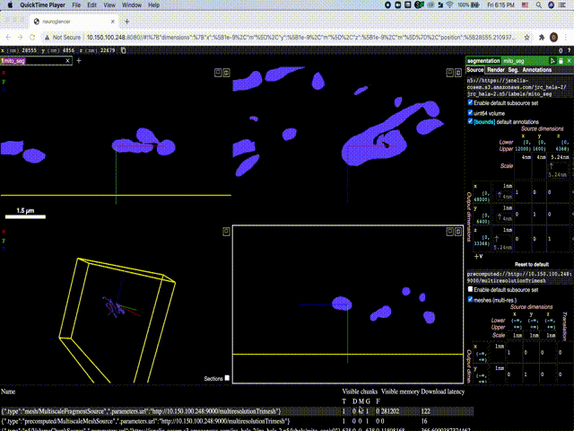

# Multiresolution Mesh Creator
This repository is meant to be used to create multiresolution meshes in the [neuroglancer precomputed format](https://github.com/google/neuroglancer/blob/master/src/neuroglancer/datasource/precomputed/meshes.md), inspired by [this comment](https://github.com/google/neuroglancer/issues/272#issuecomment-752212014) in order to be used with [neuroglancer](https://github.com/google/neuroglancer). It uses [Dask](https://dask.org/) to parallelize the mesh generation, allowing for progress to be monitored at http://localhost:8787/status.

## Installation
1. Clone this repository, and accompanying submodules.

```
git clone --recursive https://github.com/janelia-cosem/multiresolution-mesh-creator.git
```
2. `cd` to repo directory and setup a conda environment using the provided yaml file:
```
conda env update -n multiresolution_mesh_creator --file multiresolution_mesh_creator.yml
```
3. Activate the environment:
```
conda activate multiresolution_mesh_creator
```
4. Install `dvidutils` - used for custom draco quantization - as described in the submodule:
```cd dvidutils
mkdir build
cd build

# Makefiles
cmake .. \
    -DCMAKE_BUILD_TYPE=Debug \
    -DCMAKE_CXX_FLAGS_DEBUG="-g -O0 -DXTENSOR_ENABLE_ASSERT=ON" \
    -DCMAKE_PREFIX_PATH="${CONDA_PREFIX}" \
##

make
make install
```
5. Install `pyfqmr-Fast-Quadric-Mesh-Reduction` - used for mesh decimation - as described in the submodule:
```
cd pyfqmr-Fast-Quadric-Mesh-Reduction
python setup.py install
```

## Execution
This code assumes that you have either:
1. A set of high resolution (lod 0) meshes in a single directory, from which you want to create downsampled, lower resolution (higher lod) meshes.
2. Or that you already have meshes generated at all desired lod scales. If so, each set of meshes for a given lod should be in the same directory, named eg. s0, s1, s2 corresponding to lod 0, lod 1, lod 2 etc.

To create the multiresolution mesh format required by neuroglancer, you can run `create_multiresolution_meshes.py`:
```
python create_multiresolution_meshes.py --help
usage: create_multiresolution_meshes.py [-h] -i INPUT_PATH -o OUTPUT_PATH -n
                                        NUM_LODS -b BOX_SIZE [-s]
                                        [-d DECIMATION_FACTOR]

optional arguments:
  -h, --help            show this help message and exit
  -i INPUT_PATH, --input_path INPUT_PATH
                        Path to lod 0 meshes
  -o OUTPUT_PATH, --output_path OUTPUT_PATH
                        Path to write out multires meshes
  -n NUM_LODS, --num_lods NUM_LODS
                        Number of levels of detail
  -b BOX_SIZE, --box_size BOX_SIZE
                        lod 0 box size
  -s, --skip_decimation
                        (Optional) flag to skip mesh decimation if meshes
                        exist
  -d DECIMATION_FACTOR, --decimation_factor DECIMATION_FACTOR
                        (Optional) factor by which to decimate faces at each
                        lod, ie factor**lod; default is 2
```

`create_multiresolution_meshes.py` takes in an input path to the initial meshes, an output path for writing out the neuroglancer formatted meshes, the number of levels of detail and the box size for the chunking. 

If you already have meshes at all the desired scales in the corresponding `s0`, `s1`,... directories in `input_path` - either because you already ran `create_multiresolution_meshes.py` or because you already created the meshes elsewhere, then you can use the `-s` flag to skip mesh decimation. 

If you only have meshes for lod 0, then you must run mesh decimation. Mesh decimation is performed using the lod 0 meshes, reducing the number of faces by a factor of `2**lod`. You can set the scaling factor to be a number other than `2`, eg. `-d 4` would cause the faces to be decimated by a factor of `4**lod`.

## Example
Two meshes are provided in `test_meshes` as an example (a bunny (1.stl) and a teapot (2.stl)). These are provided at a single, lod 0 scale. To turn these single resolution meshes into neuroglancer formatted multiresolution meshes at eg. 5 levels of detail, with a box size 4 and face decimation factor 4, you would run the following:
```
python create_multiresolution_meshes.py -i test_meshes/ -o test_meshes_output/ -n 5 -b 4 -d 4
```

The output will be in `test_mehes_output/multires/`, and you can monitor the progress via Dask at http://localhost:8787/status. You can use something like [http-server](https://www.npmjs.com/package/http-server) to serve up that directory for viewing in neuroglancer. See the demo below to see the results of running the above command.

Note: The actual decimation amount is not guaranteed by the decimation factor, but is instead dependent on other [pyfqmr](https://github.com/Kramer84/pyfqmr-Fast-Quadric-Mesh-Reduction) settings as well, such as aggressiveness. These, and other `pyfqmr` settings can be set in the `create-multiresolution-meshes.py` if desired for further decimation customizability.





